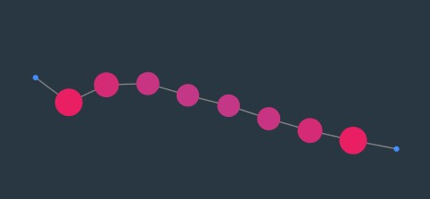
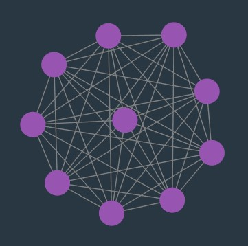
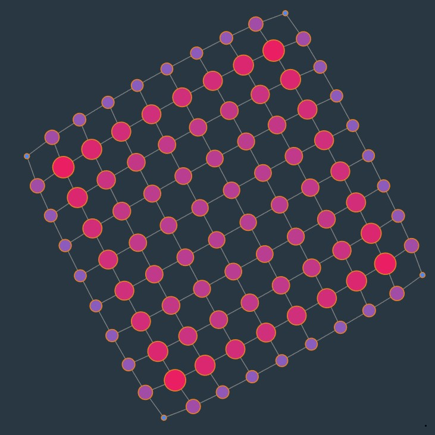
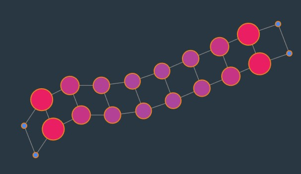

# graph-test-data

Ready-to-use synthetic graph/network data in CSV files for testing graph applications and algorithms.

(Optional) You can also tweak the generating script to generate more graphs with your specified parameters (number of nodes etc.)

Feel free to make a PR to add your generated test graph.

## Download CSV

The CSV files are readily available in the `csv/` directory. 

## Available Graphs

### Undirected Path

(10, 1000, 10000 nodes)

[Visualize in Argo Lite](https://poloclub.github.io/argo-graph-lite/#8d5667d8-95cd-4f99-ac70-93b0b2068e87)



### Undirected Complete Graph

(10, 100, 1000 nodes)

[Visualize in Argo Lite](https://poloclub.github.io/argo-graph-lite/#1fc95fea-f76c-473b-905a-01aebcc309f3)



### Undirected Grid

(5\*5, 10\*10, 30*30 nodes)

[Visualize in Argo Lite](https://poloclub.github.io/argo-graph-lite/#eaeb4496-c98e-44e3-8716-dc5c7fc6f758)



### Undirected Ladder

(10, 100, 1000 rows)

[Visualize in Argo Lite](https://poloclub.github.io/argo-graph-lite/#c083640c-4a24-40eb-9bde-d630cdc4e032)



(Make a PR to add more...)

## Run the Golang Graph File Generator

```
go run generate.go
```

CSV files will be generated under the `gen/` directory.